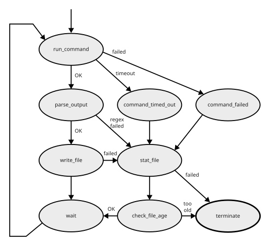

# CustomQuotaOss

An XRootD OSS plug-in to overwrite XRootD's base implementation for space usage statistics with information gathered on from file that can be written to from another service, such as the included `quota-file-writer`. 

## Block Diagram


## Quota File Writer State Diagram




## Building/Compiling

To create the shared library plug-in, run make in the "src" directory.
For this to work, you have to make 

1) the XRootD-Headers in your  includes-path (CPLUS_INCLUDE_PATH)
2) the XRootD-Client library in library-path ([Try to use LD_LIBRARY_PATH es rare as possible](https://www.hpc.dtu.dk/?page_id=1180)).

accessible to the build system.

Running 'make' will then create the shared library "LibXrdCustomQutaOss.so"

For further information on the build process, have a look at the [Containerfile](/Containerfile).

## Rocky8/Rocky9 RPM build containers

* In this repo's root directory, create a symlink to the files `Containerfile` and `XrdCustomQuotaOss.spec` in `build-workflow/rocky8` or `build-workflow/rocky9`
    ```
    $ ln -s build-workflow/rocky9/Containerfile .
    $ ln -s build-workflow/rocky9/XrdCustomQuotaOss.spec .
    ```
* Use the Containerfile with podman to compile the library and package it into a rpm using:

    ```
    $ podman build -t customquota .
    $ podman run -v ./rpm:/rpm -it customquota
    ```

The el8 rpm will then be stored in your local rpm directory.

## Configuration

This plug-in is loaded by the XRootD server.
In order to accomplish this, you need to indicate the server where the plugin lies in the server's configuration file.
Configure your lustre mountpoint and the number of seconds until the cache is invalidated.
```shell
ofs.osslib  /path/to/LibXrdCustomQuotaOss.so
customquota.sourcefile /path/to/sourcefile

```

## Usage

When using this plug-in, all high level XRootD usage statistics calls (xrdfs spaceinfo for example) need to be fed into the configured sourcefile from another process.

## License

The CustomQuotaOss plug-in is distributed under the terms of the GNU Lesser Public Licence version 3 (LGPLv3)


